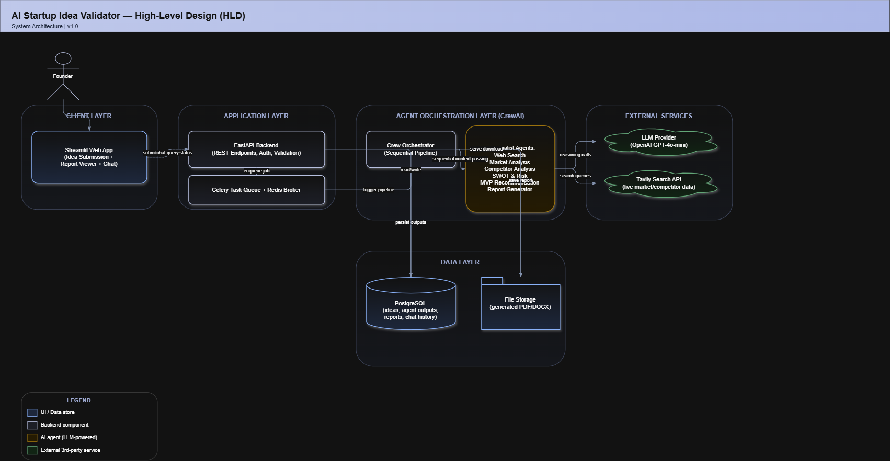
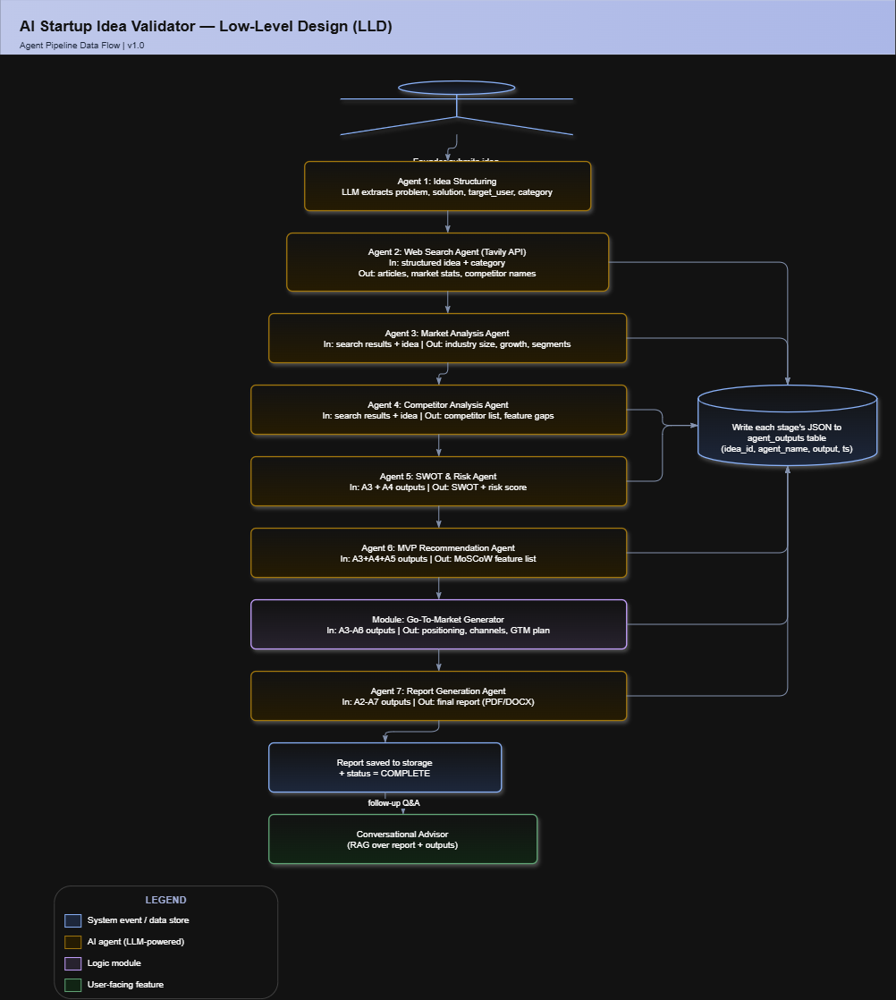

# AI Startup Validator - Multi-Agent System Architecture

## Diagrams

### High-Level Design (HLD)

### Low-Level Design (LLD)

Editable source files: [HLD.drawio](diagrams/HLD.drawio), [LLD.drawio](diagrams/LLD.drawio) — open with [draw.io](https://app.diagrams.net/) (File → Open Existing Diagram) or the [draw.io VS Code extension](https://marketplace.visualstudio.com/items?itemName=hediet.vscode-drawio).
