# Pipeline Flow (pipeline/graph.py)

Sequential LangGraph pipeline. Each node runs one agent, reads the shared
`GraphState`, and writes its result back into that same state before the
next node runs.

```mermaid
flowchart LR
    START([START]) --> WS[Web Search Agent]
    WS -->|"search_results, references"| MA[Market Analysis Agent]
    MA -->|"market_analysis"| CA[Competitor Agent]
    CA -->|"competitor_analysis, competitors"| SW["SWOT &amp; Risk Agent"]
    SW -->|"swot_analysis"| MVP[MVP Recommendation Agent]
    MVP -->|"mvp_recommendation"| GTM[GTM Strategy Agent]
    GTM -->|"gtm_strategy"| RA[Report Agent]
    RA -->|"report"| END_([END])
```

## Notes

- Nodes run strictly in order: `web_search` &rarr; `market_analysis` &rarr;
  `competitor_analysis` &rarr; `swot_analysis` &rarr; `mvp_recommendation`
  &rarr; `gtm_strategy` &rarr; `report_generation`.
- Every node writes its output into the same shared `GraphState` object,
  which is what carries context forward to the next agent.
- If a node's agent call fails, `record_error()` logs the failure into
  `state["errors"]` and sets `execution_status = "failed"`, but the graph
  has no conditional edges to stop early &mdash; execution continues to
  the next node regardless.
