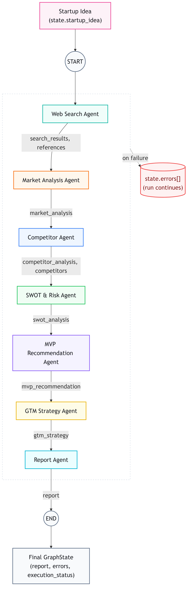
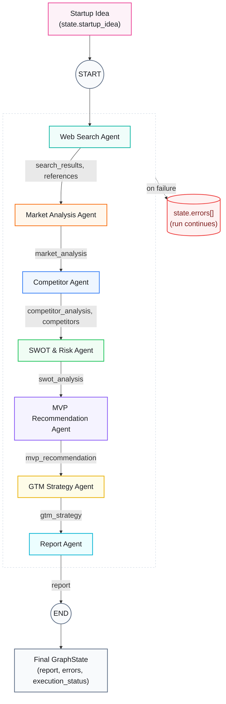

# Pipeline Flow (pipeline/graph.py)

Sequential LangGraph pipeline. Each node runs one agent, reads the shared
`GraphState`, and writes its result back into that same state before the
next node runs.

## Notes

- Nodes run strictly in order: `web_search` &rarr; `market_analysis` &rarr;
  `competitor_analysis` &rarr; `swot_analysis` &rarr; `mvp_recommendation`
  &rarr; `gtm_strategy` &rarr; `report_generation`.
- Every node writes its output into the same shared `GraphState` object,
  which is what carries context forward to the next agent &mdash; agents
  never call each other directly.
- Each node's agent instance (`web_search_agent`, `market_agent`,
  `competitor_agent`, `swot_agent`, `mvp_agent`, `gtm_agent`,
  `report_agent`) is created once at module load and reused for every run.
- If a node's agent call fails (returns a non-`"success"` status, or raises),
  `record_error()` appends the failure to `state["errors"]` and sets
  `state["execution_status"] = "failed"` &mdash; shown above as the dashed
  path every node can take.
- Critically, the graph has **no conditional edges to stop on failure**:
  even after an error is recorded, execution continues on to the next
  node regardless, all the way to `report_generation`.
